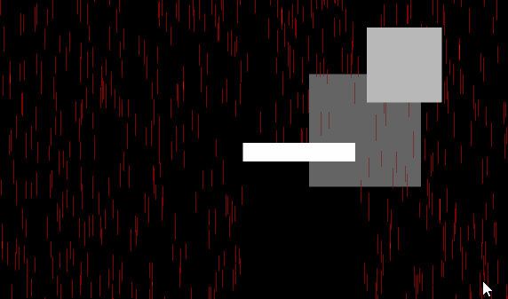

# UnityGPUParticles
simple gpu instancing particles with collision calculation

- Particles draw using `CommandBuffer.DrawMeshInstancedIndirect`.
- Render to fullscreen RenderTexture for 2D sprite layering.
- Collision calculation implements on compute shader 10 times per second. 

## LICENSE
You can use this software in a commercial game, but you cannot sell this software on the Unity Asset Store or any other platform that sells software tools for developers.